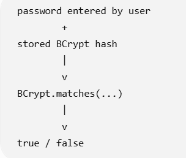

                    LOGIN REQUEST
                         |
                         v
                username = raj
                password = hello123
                         |
                         v
          ReactiveAuthenticationManager
                         |
                         v
             ReactiveUserDetailsService
                         |
                         v
                 Find "raj"
                         |
                         v
                  Database
                         |
                         v
              Stored BCrypt hash
                         |
                         v
                 PasswordEncoder
                         |
                 BCrypt comparison
                    /          \
                   /            \
              MATCH            NO MATCH
                |                  |
                v                  v
          Authentication       Authentication
             SUCCESS              FAILURE

BCrypt is a one-way hashing algorithm.

Instead, Spring effectively does:

 

Use Below: 

Spring MVC                         Spring WebFlux

UserDetailsService          →      ReactiveUserDetailsService

AuthenticationManager       →      ReactiveAuthenticationManager

SecurityFilterChain         →      SecurityWebFilterChain

--------------------------------------------------

PasswordEncoder
↓
Responsible for password hashing/comparison

ReactiveUserDetailsService
↓
Responsible for finding user

ReactiveAuthenticationManager
↓
Combines user lookup + password verification

--------------------------------------------------

